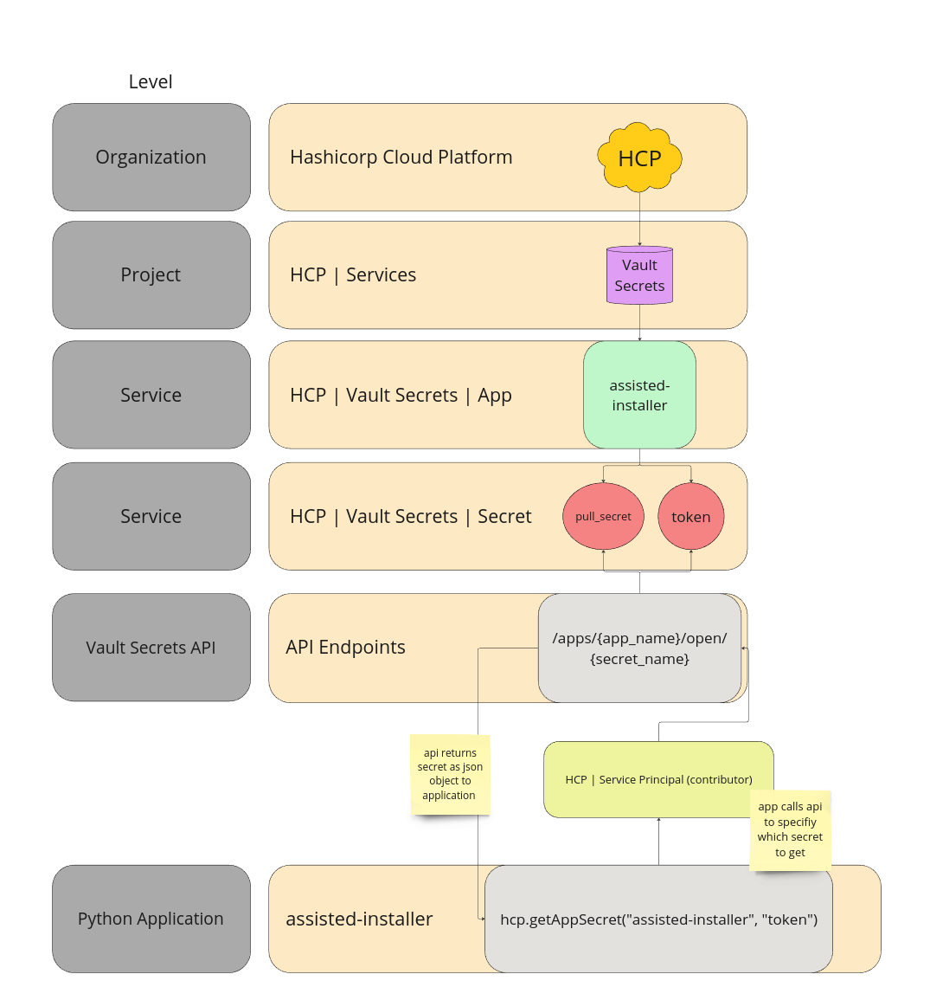

# assisted-installer
Python repository to install a bare metal openshift cluster to a proxmox virtual environment using the Red Hat Assisted Installer API.

## Description
An application written in python to configure, deploy, and manage Red Hat OpenShift clusters using the Red Hat Assisted Installer and your Red Hat account. The application will also interface with a local proxmox virutal environment API to manage the virtual machine configurations backing the cluster, Currently, there are two sizes supported

| Size | Control-Nodes | CPU (per-node) | Memory (per-node) | Storage (per-node) |
| ---  | ------------- | --- | ------ | ------- |
| sno (single node openshift) | 1 | 8vcpu | 32000 | 200GiB | 
| compact | 3 | 4 | 16GiB | 200GiB|

The application utilizes the Hashicorp Cloud Platform - Vault Secrets API, as a secure way to interface with sensitive information such as admin tokens, passwords, and secrets that will be needed for authentication across the various services this project uses.

## Commands


### deploycluster

    $ ./main.py deploycluster --name=<cluster-name> --version=<cluster-version> --basedomain=<domain> --size=<size>


**Options**

```
  name: name 
    required: true
    default: ""
    type: str
    description: name of the openshift cluster to create
    example: ocp

  name: version
    required: false
    default: latest stable release
    type: str
    description: openshift version (major.minor), defaults to latest stable release
    example: 4.15, 4.14

  name: basedomain
    required: true
    default: ""
    type: str
    description: base domain to build the openshift routes 
    example: "example.com"
```


### removecluster

    $ ./main.py removecluster --name=<cluster-name>

**Options**

```
  name: name 
    required: true
    default: ""
    type: str
    description: name of the openshift cluster to delete
    example: ocp

```


## Dependancies

- `python3.12.2+`


**Environment Variables** 

- `clientID`: This is the clientID that is associated with the service principal in HashiCorp Cloud Platform.

- `clientSecret`: This is the clientSecret that is associated with the service principal in HashiCorp Cloud Platform.

- `organizationID`: The HashiCorp Cloud Platform organization ID that owns the Vault Secrets application

- `projectID`: The HashiCorp Cloud Platform project ID where the Vault Secrets application is located

- `proxmoxIP`: The local IP of your proxmox virtual environment

- `proxmoxUser`: The username@pam used for authentication against the pve API


**Vault Secrets**

| Apps | Key(s) |
| ------- | --- |
| assisted-installer | `[pull_secret, token]` |
| proxmox | `[password]` |

### Hashicorp Cloud Platform (HCP)

**HCP Topology**

- Organization -> Project(s) -> Service(s) [e.g Vault Secrets] -> Application -> Key/Value (secret)



This code is opinionated, and assumes that you are using the Hashicorp Cloud Platform (HCP) | Vault Secrets service to store sensitive information/credentials that you do not want exposed within the repo itself. An example would be the `pull_secret` and `token` that are used for authenticating against the Red Hat Assisted Installer. This service as of 4/19/24 is free, and allows us to store up to 25 secrets.

In order for the code to function properly, we will need to set a few environment variables to provide authentication to the HCP API such that we can retrieve the secret values for other sensitive information.

You can find the `organizationID` and `projectID` in their respective settings tab in HCP. However, in order to get the clientID and clientSecret, you will need to navigate to the `Projects` -> `<Project Name>` -> `Access Control (IAM)` -> `Service Principals` tab within your organization. Create a service principal with the `Contributer Role` and generate keys. This will populate a `clientID` and `clientSecret` that the code will use to authenticate to the HCP API


## References

- [Hashicorp Cloud Platform | Vault Secrets](https://developer.hashicorp.com/hcp/docs/vault-secrets)
